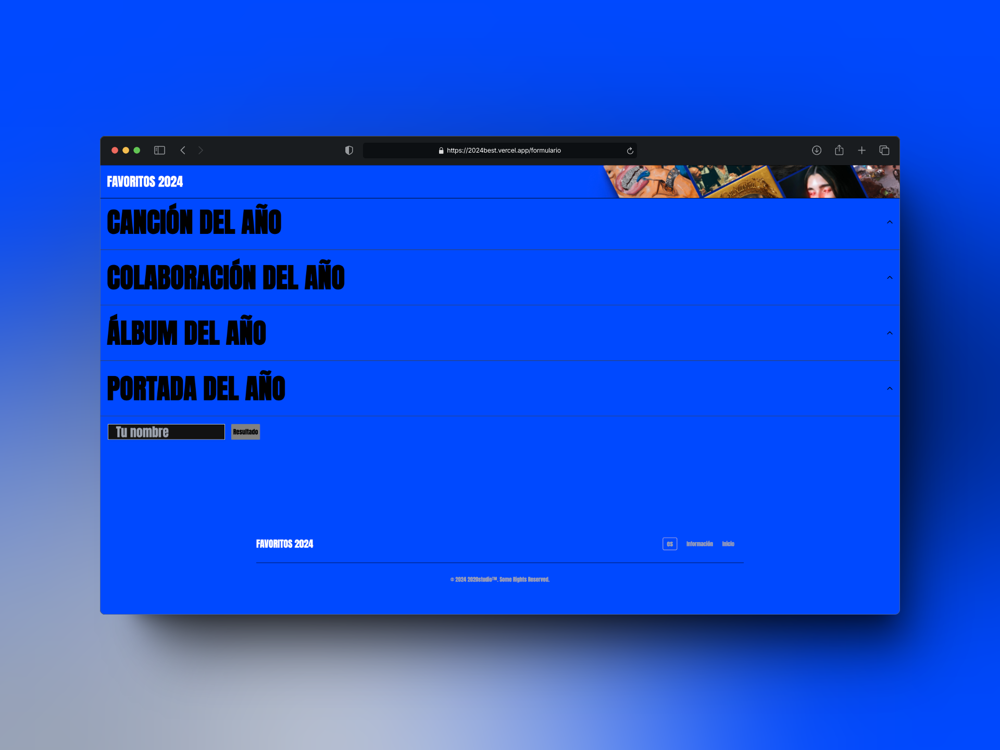

# Proyecto: API TUS FAVORITAS 2024 - Backend

Esta es la API que utiliza el proyecto TUS FAVORITAS 2024. Utiliza la api de genius para obtener las canciones

## Tecnologías utilizadas

- **Node.js**: Plataforma de ejecución para el servidor.
- **Express**: Framework para la creación de la API RESTful.

## Estado del proyecto
El proyecto esta finalizado, pero si piensas que puedes colaborar no dudes en hacerlo.

## Instalación

1. **Clona el repositorio:**
   ```bash
   git clone git@github.com:pabloconejos/api_2024best.git
2. **Navega al directorio del proyecto:**
    ```bash
    cd api_2024best
3. **Instala las dependencias:**
    ```bash
    npm install
4. **Configura las variables de entorno en .env:**
    ```bash
    AUTHTOKEN=
    
5. **Ejecuta el servidor en modo de desarrollo:**
   ```bash
   npm run dev


## Cómo Colaborar

1. **Clona el Repositorio**

   Haz un Fork y clona el respositorio
   
2. **Instala las Dependencias**

    Navega a la carpeta del backend e instala las dependencias necesarias con:
  
    ```bash
    cd api_2024best
    npm install

3. **Configura el Fronted**

    Asegúrate de seguir las instrucciones específicas del frontend para su configuración.
    ```bash
    https://github.com/pabloconejos/2024best.git

## Contribuye con Cambios

Para contribuir al proyecto, sigue estos pasos:

1. **Crea una rama para tus cambios:**

   ```bash
   git checkout -b mi-rama
   
2. **Realiza tus modificaciones y haz commit:**

    ```bash
    git commit -am 'Descripción de los cambios'
3. **Envía tus cambios a GitHub:**

    ```bash
    git push origin mi-rama
    
4. **Abre un pull request para revisar tus cambios.**
